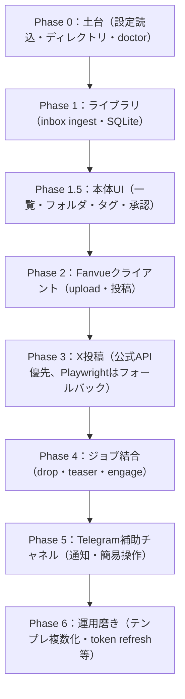

# ロードマップ

Phase構成は [CLAUDE_HANDOFF.md](../CLAUDE_HANDOFF.md) 11章に基づく。各Phaseの完了条件は「そのPhase単体で手動1回成功し、失敗がTelegramまたはログに残ること」。

ReelMillyはアセット（画像・動画）管理を中核に据え、SNS投稿はその上に付加する機能という位置づけ（[ADR-0007](adr/0007-asset-management-as-core.md)）。この位置づけに基づき、Phase 1にNSFW自動仕分け、Phase 5にその人間承認ステップを追加する（[ADR-0008](adr/0008-nsfw-auto-triage-with-human-approval.md)）。

画像・動画管理は外部ツール（Eagle）連携ではなくReelMilly自身に実装し（[ADR-0010](adr/0010-custom-asset-management-over-eagle.md)）、数万件規模を見据えてメタデータ管理を`meta.yaml`からSQLiteに変更した（[ADR-0011](adr/0011-sqlite-state-store.md)）。これに伴いPhase 1の内容を「ライブラリ（SQLite）」に更新し、フォルダ・タグ管理を含むアセット管理UIをPhase 1.5として追加する。

本体（画像管理アプリ）を優先実装し、SNS投稿機能は論理プラグインとして分離する（[ADR-0013](adr/0013-sns-posting-as-logical-plugin.md)）。操作・通知の主役もTelegramから本体UIに移り、Telegramは通知＋簡易操作（承認・スキップ）の補助チャネルとなる（[ADR-0012](adr/0012-primary-ui-with-telegram-as-secondary.md)）。これに伴い、Phase 1.5に「承認・`content_rating`確定」操作を含め、Phase 5は「Telegram通知＋簡易操作」に役割を縮小する。

X投稿は公式API（申請ファースト）を採用する（[ADR-0014](adr/0014-x-official-api-application-first.md)）。開発者アプリの承認を待つ間、Phase 2/3の順序を入れ替え、SNS投稿と無関係なPhase 0/1/1.5を先に進める。Phase 3はPlaywrightではなく公式APIでの実装を基本とし、承認が得られない場合のみPlaywrightにフォールバックする。

## 全体像

## Phase一覧

| Phase | 内容 | 状態 |
|---|---|---|
| Phase 0 | 設定読込、ディレクトリ作成、events.jsonl、doctor | 実装済み（`src/core/config.py`/`cli.py`）。実機での動作確認は未実施 |
| Phase 1 | inbox ingest、sidecarマージ、ready/posted移動、**SQLiteへのメタデータ記録**（[ADR-0011](adr/0011-sqlite-state-store.md)）、**NSFW自動仕分け（`nsfw_auto_rating`記録）** | 実装済み（`src/core/ingest.py`/`nsfw.py`）。NSFW判定精度の実データ検証は未実施 |
| Phase 1.5 | 本体UI（一覧・サムネイル表示・フォルダ管理・タグ管理・**投稿承認/`content_rating`確定操作**。全文検索は対象外）（[ADR-0010](adr/0010-custom-asset-management-over-eagle.md)、[ADR-0012](adr/0012-primary-ui-with-telegram-as-secondary.md)） | 実装済み（`src/core/web/`、Flask） |
| Phase 2 | Fanvue multipart upload、ready待ち、create post、URL組み立て（`posting`モジュール、[ADR-0013](adr/0013-sns-posting-as-logical-plugin.md)） | クライアント実装済み（`src/posting/fanvue.py`）。実API疎通確認は未実施（TODO.md参照） |
| Phase 3 | X投稿（`posting`モジュール）。公式API（`POST /2/tweets`、`POST /2/media/upload`）を優先実装。開発者アプリ未承認の場合のみPlaywright login・失敗スクショ等を実装（[ADR-0014](adr/0014-x-official-api-application-first.md)） | 未着手（開発者アプリ申請・承認待ち、TODO.md参照） |
| Phase 4 | drop/teaser/engageジョブ結合、部分失敗ルール、last_run管理、**`content_rating_confirmed`未承認アセットの投稿対象外フィルタ**、**自動実行スケジューラ** | dropジョブのFanvue投稿部分（`posting/jobs.py`の`run_fanvue_drop`、`reelmilly run drop`、成功時の投稿済みタグ付与）と、`config.yaml`の`cadence`設定に基づく自動実行（`reelmilly run-due`/`reelmilly watch`）を実装済み。X紹介投稿・x_teaser・x_engagementはPhase 3待ち |
| Phase 5 | Telegram allowlist、通知、**簡易操作（承認/スキップのみ、詳細操作は本体UIへ）**（`telegram`モジュール、[ADR-0012](adr/0012-primary-ui-with-telegram-as-secondary.md)） | 未着手 |
| Phase 6 | 文面テンプレ複数化、サムネオプション、token refresh、ファイル受信 | 未着手 |

## 受け入れ基準（全体）

CLAUDE_HANDOFF.md 14章より:

- inboxにmp4を置く → ingest → Telegramにidが来る
- Approve後、Fanvueに有料/無料投稿が1本できる
- 続けてXにFanvue URL入りの紹介文が投稿される
- X未ログイン時は投稿せずTelegramで止まる（公式API採用時は「トークン失効時」に読み替え）
- Fanvue成功・X失敗でFanvueに二重投稿しない
- 月木以外にengagementが走らない
- `.env`以外に秘密が出ない
