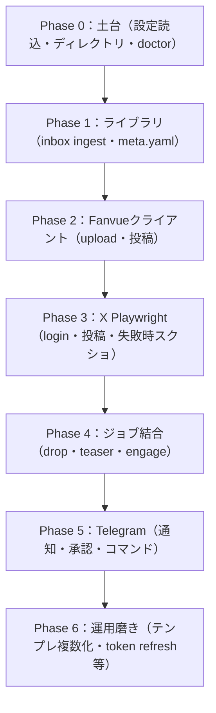

# ロードマップ

Phase構成は [CLAUDE_HANDOFF.md](../CLAUDE_HANDOFF.md) 11章に基づく。各Phaseの完了条件は「そのPhase単体で手動1回成功し、失敗がTelegramまたはログに残ること」。

## 全体像

## Phase一覧

| Phase | 内容 | 状態 |
|---|---|---|
| Phase 0 | 設定読込、ディレクトリ作成、events.jsonl、doctor | 未着手 |
| Phase 1 | inbox ingest、sidecarマージ、ready/posted移動、meta.yaml | 未着手 |
| Phase 2 | Fanvue multipart upload、ready待ち、create post、URL組み立て | 未着手 |
| Phase 3 | X Playwright login、テキスト投稿、任意メディア、失敗スクショ | 未着手（デプロイ環境の決定が前提、TODO.md参照） |
| Phase 4 | drop/teaser/engageジョブ結合、部分失敗ルール、last_run管理 | 未着手 |
| Phase 5 | Telegram allowlist、通知、承認フロー、コマンド | 未着手 |
| Phase 6 | 文面テンプレ複数化、サムネオプション、token refresh、ファイル受信 | 未着手 |

## 受け入れ基準（全体）

CLAUDE_HANDOFF.md 14章より:

- inboxにmp4を置く → ingest → Telegramにidが来る
- Approve後、Fanvueに有料/無料投稿が1本できる
- 続けてXにFanvue URL入りの紹介文が投稿される
- X未ログイン時は投稿せずTelegramで止まる
- Fanvue成功・X失敗でFanvueに二重投稿しない
- 月木以外にengagementが走らない
- `.env`以外に秘密が出ない
