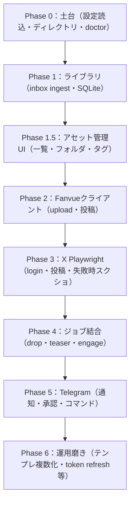

# ロードマップ

Phase構成は [CLAUDE_HANDOFF.md](../CLAUDE_HANDOFF.md) 11章に基づく。各Phaseの完了条件は「そのPhase単体で手動1回成功し、失敗がTelegramまたはログに残ること」。

ReelMillyはアセット（画像・動画）管理を中核に据え、SNS投稿はその上に付加する機能という位置づけ（[ADR-0007](adr/0007-asset-management-as-core.md)）。この位置づけに基づき、Phase 1にNSFW自動仕分け、Phase 5にその人間承認ステップを追加する（[ADR-0008](adr/0008-nsfw-auto-triage-with-human-approval.md)）。

画像・動画管理は外部ツール（Eagle）連携ではなくReelMilly自身に実装し（[ADR-0010](adr/0010-custom-asset-management-over-eagle.md)）、数万件規模を見据えてメタデータ管理を`meta.yaml`からSQLiteに変更した（[ADR-0011](adr/0011-sqlite-state-store.md)）。これに伴いPhase 1の内容を「ライブラリ（SQLite）」に更新し、フォルダ・タグ管理を含むアセット管理UIをPhase 1.5として追加する。

## 全体像

## Phase一覧

| Phase | 内容 | 状態 |
|---|---|---|
| Phase 0 | 設定読込、ディレクトリ作成、events.jsonl、doctor | 未着手 |
| Phase 1 | inbox ingest、sidecarマージ、ready/posted移動、**SQLiteへのメタデータ記録**（[ADR-0011](adr/0011-sqlite-state-store.md)）、**NSFW自動仕分け（`nsfw_auto_rating`記録）** | 未着手 |
| Phase 1.5 | アセット管理UI（一覧・サムネイル表示・フォルダ管理・タグ管理。全文検索は対象外）（[ADR-0010](adr/0010-custom-asset-management-over-eagle.md)） | 未着手 |
| Phase 2 | Fanvue multipart upload、ready待ち、create post、URL組み立て | 未着手 |
| Phase 3 | X Playwright login、テキスト投稿、任意メディア、失敗スクショ | 未着手（デプロイ環境の決定が前提、TODO.md参照） |
| Phase 4 | drop/teaser/engageジョブ結合、部分失敗ルール、last_run管理、**`content_rating_confirmed`未承認アセットの投稿対象外フィルタ** | 未着手 |
| Phase 5 | Telegram allowlist、通知、承認フロー、コマンド、**NSFW自動仕分け結果の確認・補正フロー（`content_rating`確定操作）** | 未着手 |
| Phase 6 | 文面テンプレ複数化、サムネオプション、token refresh、ファイル受信 | 未着手 |

## 受け入れ基準（全体）

CLAUDE_HANDOFF.md 14章より:

- inboxにmp4を置く → ingest → Telegramにidが来る
- Approve後、Fanvueに有料/無料投稿が1本できる
- 続けてXにFanvue URL入りの紹介文が投稿される
- X未ログイン時は投稿せずTelegramで止まる
- Fanvue成功・X失敗でFanvueに二重投稿しない
- 月木以外にengagementが走らない
- `.env`以外に秘密が出ない
